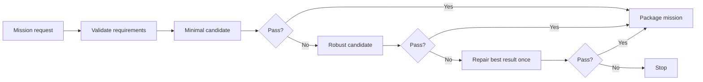

# COR-SAT

Natural-language mission generation and runtime tooling for a Raspberry Pi CubeSat camera payload.



## What's included

| Area | Purpose |
| --- | --- |
| `agents/` | Generate, evaluate, repair, and package missions |
| `runner/` | Validate, launch, supervise, stop, and inspect missions |
| `sdk/` | Python client for the satellite HAL |
| `hal/` | Rust HTTP service for camera and system access |
| `missions/` | Ready-to-run mission packages |
| `schematics/` | KiCad design, PDF schematic, and STEP models |

## Quick start

| Task | Requirements |
| --- | --- |
| Generate and test | Python 3.11+, [Ollama](https://ollama.com/) |
| Run the HAL | Rust, Cargo, Raspberry Pi camera stack, IMX219 NoIR |
| Run optical flow | OpenCV and NumPy |

```text
python -m venv .venv
# Linux or Raspberry Pi
source .venv/bin/activate
# Windows PowerShell
.\.venv\Scripts\Activate.ps1

python -m pip install -e . ollama requests
ollama pull qwen3:4b-instruct
```

For optical-flow missions: `python -m pip install opencv-python numpy`

Generate a mission candidate:

```bash
python -m agents.cli "Capture seven images at three-second intervals." --candidate demo
```

Output: `agents/candidates/demo/`

## Run a mission

Start the HAL on the Raspberry Pi:

```bash
cargo run --manifest-path hal/Cargo.toml
```

Run the mission runner on the same Pi. The SDK connects to `localhost:3000` by default.

Then launch a packaged mission:

```bash
python -m runner.cli supervise periodic-camera
```

Or launch a generated candidate:

```bash
python -m runner.cli supervise demo --candidate
```

| Action | Command |
| --- | --- |
| Status | `python -m runner.cli status demo` |
| Logs | `python -m runner.cli logs demo --lines 100` |
| Stop | `python -m runner.cli stop demo` |

Runtime state, heartbeats, and logs are stored in `runtime/<mission-name>/`.

## Supported requests

| Capability | Status |
| --- | :---: |
| Timed camera capture | Yes |
| Heartbeats | Yes |
| Shutdown handling | Yes |
| Sparse Lucas-Kanade optical flow | Yes |
| Communications | No |
| IMU | No |
| Actuators | No |

Unsupported capabilities are rejected before generation.

## Validation pipeline

Candidates must pass:

1. Python syntax checks
2. Import and file-write safety checks
3. Fake SDK execution
4. Mission-specific behavior checks
5. Runner manifest validation

Model calls are source-only. The controller creates and validates `manifest.json`.

## Tests

```bash
python -m unittest discover -s tests -v
```

Tests mock model calls and require neither Ollama nor camera hardware.

## Hardware

- [KiCad project](schematics/sat_ir_link/sat_ir_link.kicad_pro)
- [Schematic PDF](schematics/sat_ir_link.pdf)
- [Board STEP model](schematics/sat_ir_link/v23d-print-board.step)

## License

[MIT](LICENSE)
