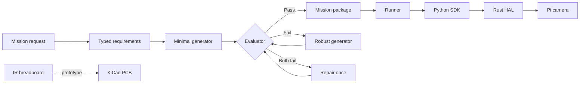

# COR-SAT

COR-SAT turns natural-language mission requests into tested Python mission packages for a Raspberry Pi satellite payload. It combines AI-assisted generation, deterministic evaluation, a supervised runtime, a Python hardware SDK, a Rust HAL, camera capture, and prototype infrared communications hardware.

> Experimental project. Generated missions are limited to the capabilities and checks documented below.

## System overview



Model calls return text only and never write project files. The controller validates requirements, evaluates behavior, writes the package, derives `manifest.json`, and validates the final package against the runner schema.

## Project status

| Area | Status |
| --- | --- |
| Camera mission generation | Working |
| Timed capture and heartbeats | Working |
| Shutdown handling | Working |
| Sparse Lucas-Kanade optical flow | Working |
| Mission supervision and logs | Working on Linux and Raspberry Pi OS |
| IR communications hardware | Breadboard and KiCad prototype |
| IR communications mission API | Not implemented |
| IMU and actuator support | Not implemented |

## Repository map

| Path | Purpose |
| --- | --- |
| `agents/` | Parse, generate, evaluate, repair, and package missions |
| `runner/` | Validate, launch, supervise, stop, and inspect missions |
| `sdk/` | Python client for the satellite HAL |
| `hal/` | Rust HTTP service for camera and system access |
| `missions/` | Reviewed mission packages |
| `runtime/` | Mission state, heartbeat data, and logs |
| `schematics/` | KiCad project, schematic PDF, PCB, and STEP models |
| `demo/` | Offline HTML presentation with embedded media |
| `tests/` | Unit and acceptance tests |

## Requirements

### Development and mission generation

- Git
- Python 3.11+
- [Ollama](https://ollama.com/)
- `qwen3:4b-instruct`

### Physical payload runtime

- Raspberry Pi running Linux or Raspberry Pi OS
- Rust 1.85+ and Cargo
- Raspberry Pi camera stack with `rpicam-still`
- IMX219 NoIR camera for the current HAL tuning configuration

### Optional optical flow

- OpenCV
- NumPy

Mission generation and tests can run without camera hardware. Physical mission execution and runner supervision are intended for Linux or the Raspberry Pi.

## 1. Clone and install

```bash
git clone https://github.com/dmarcr1997/COR-SAT.git
cd COR-SAT
python -m venv .venv
```

Activate the environment:

| Platform | Command |
| --- | --- |
| Linux or Raspberry Pi | `source .venv/bin/activate` |
| Windows PowerShell | `.\.venv\Scripts\Activate.ps1` |

Commands below use `python`. On Raspberry Pi OS, use `python3` if `python` is not available.

Install the SDK and generation dependencies:

```bash
python -m pip install --upgrade pip
python -m pip install -e . ollama requests
```

For missions that calculate optical flow:

```bash
python -m pip install opencv-python numpy
```

## 2. Configure Ollama

Pull the model used by the generator:

```bash
ollama pull qwen3:4b-instruct
```

Start Ollama if it is not already running:

```bash
ollama serve
```

The generator expects Ollama on its default local endpoint and uses `qwen3:4b-instruct`. The model is configured in `agents/generator.py`. There is currently no project CLI flag for changing the model or Ollama host.

## 3. Verify the software setup

```bash
python -m unittest discover -s tests -v
cargo test --manifest-path hal/Cargo.toml
```

The Python suite mocks model calls, camera hardware, time delays, and OpenCV behavior. It does not require Ollama or a connected camera. The Cargo command tests the Rust HAL.

## 4. Generate a mission

```bash
python -m agents.cli "Capture seven images at three-second intervals and send a heartbeat before every capture." --candidate demo
```

Generated files:

```text
agents/candidates/demo/
|-- manifest.json
`-- mission.py
```

Use a new candidate name for each run. Existing candidate directories are not overwritten.

### Supported request examples

```text
Capture one image.
Capture five images at two-second intervals.
Capture twenty images and calculate sparse optical flow in four groups.
Capture seven images, heartbeat before each capture, and handle shutdown signals.
```

Requests for communications, IMU, or actuator behavior are rejected before generation.

## 5. Prepare the Raspberry Pi

Install the camera module and use a current Raspberry Pi OS release. Raspberry Pi OS includes the standard `rpicam-*` tools. See the official [camera setup guide](https://www.raspberrypi.com/documentation/computers/camera_software.html).

Install Rust with [rustup](https://www.rust-lang.org/tools/install), then select an edition 2024-compatible toolchain:

```bash
curl --proto '=https' --tlsv1.2 -sSf https://sh.rustup.rs | sh
source "$HOME/.cargo/env"
rustup update stable
rustc --version
```

Rust 1.85 or newer is required.

Confirm that the camera stack can see the sensor:

```bash
rpicam-still --list-cameras
```

The current HAL uses the Raspberry Pi 5 IMX219 NoIR tuning file. Confirm it exists:

```bash
test -f /usr/share/libcamera/ipa/rpi/pisp/imx219_noir.json
```

Earlier Raspberry Pi models store tuning files under `/usr/share/libcamera/ipa/rpi/vc4/`. Update the HAL tuning path before building if you use one of those models.

Build the HAL:

```bash
cargo build --release --manifest-path hal/Cargo.toml
```

Start the HAL from the repository root:

```bash
cargo run --release --manifest-path hal/Cargo.toml
```

The service listens on `0.0.0.0:3000`. The Python SDK connects to `http://localhost:3000` by default, so the runner and HAL should run on the same Pi unless the client configuration is changed.

### Verify the HAL

```bash
curl http://localhost:3000/v1/system/health
curl http://localhost:3000/v1/system/status
curl http://localhost:3000/v1/system/capabilities
curl -X POST http://localhost:3000/v1/camera/capture
```

Camera captures are written to `hal/caps/` when the HAL is started from the repository root.

## 6. Run a mission

Run the included camera mission:

```bash
python -m runner.cli supervise periodic-camera
```

Run a generated candidate:

```bash
python -m runner.cli supervise demo --candidate
```

`supervise` monitors the process, checks heartbeats, and restarts one unexpected failure. Use `start` when supervision is not needed.

`supervise` stays in the foreground. Open a second terminal to inspect status or logs, or to stop the mission.

## Runtime controls

| Action | Command |
| --- | --- |
| Start reviewed mission | `python -m runner.cli start periodic-camera` |
| Supervise reviewed mission | `python -m runner.cli supervise periodic-camera` |
| Start candidate | `python -m runner.cli start demo --candidate` |
| Supervise candidate | `python -m runner.cli supervise demo --candidate` |
| Show status | `python -m runner.cli status demo` |
| Show logs | `python -m runner.cli logs demo --lines 100` |
| Stop mission | `python -m runner.cli stop demo` |

Runtime artifacts:

```text
runtime/<mission-name>/
|-- heartbeat.json
|-- mission.log
`-- state.json
```

Mission-generated files are stored beside the mission code:

| Mission type | Output directory |
| --- | --- |
| Reviewed | `missions/<name>/outputs/` |
| Candidate | `agents/candidates/<name>/outputs/` |

Optical-flow missions write JPEG results to that `outputs/` directory.

## Validation pipeline

Every candidate must pass:

1. Validated typed requirements
2. Python syntax checks
3. Import and file-write safety checks
4. Fake SDK execution
5. Capture, timing, heartbeat, and output checks
6. Mission-specific optical-flow checks when requested
7. Runner manifest validation

If both generated candidates fail, the highest-scoring failure is repaired once and evaluated again. A failed repair stops the pipeline without creating a package.

## Hardware

The camera payload is connected through the Rust HAL. The infrared link is a separate hardware prototype and is not yet exposed through the SDK or mission generator.


| Artifact | Link |
| --- | --- |
| KiCad project | [`sat_ir_link.kicad_pro`](schematics/sat_ir_link/sat_ir_link.kicad_pro) |
| PCB layout | [`sat_ir_link.kicad_pcb`](schematics/sat_ir_link/sat_ir_link.kicad_pcb) |
| Schematic | [`sat_ir_link.kicad_sch`](schematics/sat_ir_link/sat_ir_link.kicad_sch) |
| Schematic PDF | [`sat_ir_link.pdf`](schematics/sat_ir_link.pdf) |
| Board STEP model | [`v23d-print-board.step`](schematics/sat_ir_link/v23d-print-board.step) |

## Presentation demo

Open [`demo/index.html`](demo/index.html) in a browser. The presentation works offline and includes keyboard navigation, speaker notes, the software demonstration, and project hardware images.

| Key | Action |
| --- | --- |
| Left or Right arrow | Change slide |
| `N` | Toggle speaker notes |
| `F` | Toggle fullscreen |

## Troubleshooting

| Problem | Check |
| --- | --- |
| Ollama connection fails | Run `ollama serve` and confirm the model is pulled |
| Candidate already exists | Choose a new value for `--candidate` |
| HAL reports an unhealthy camera | Run `rpicam-still --list-cameras` |
| Camera capture fails | Confirm `rpicam-still` and the IMX219 NoIR tuning file are installed |
| Mission cannot reach HAL | Confirm the HAL is running on port `3000` on the same host |
| Supervision or stop fails on Windows | Run the mission runtime on Linux or Raspberry Pi OS |
| Optical-flow mission fails at runtime | Install `opencv-python` and `numpy` in the mission environment |

## License

[MIT](LICENSE)
